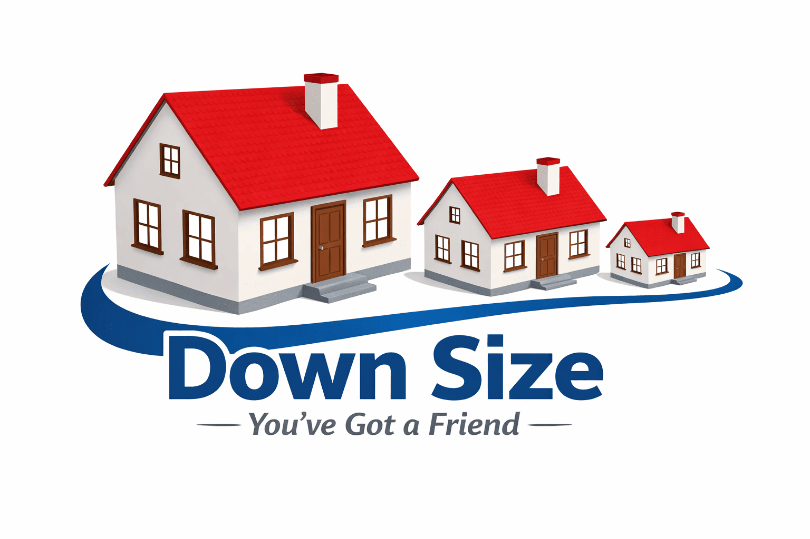
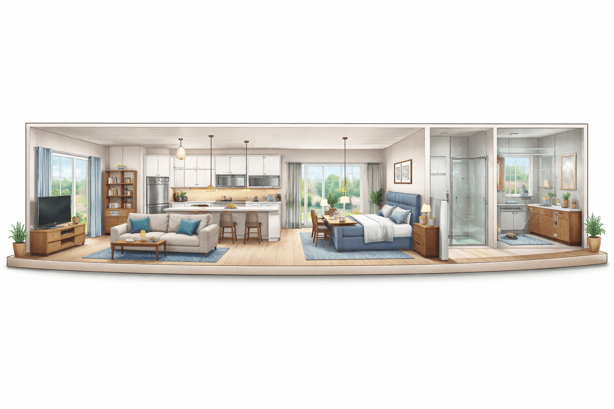
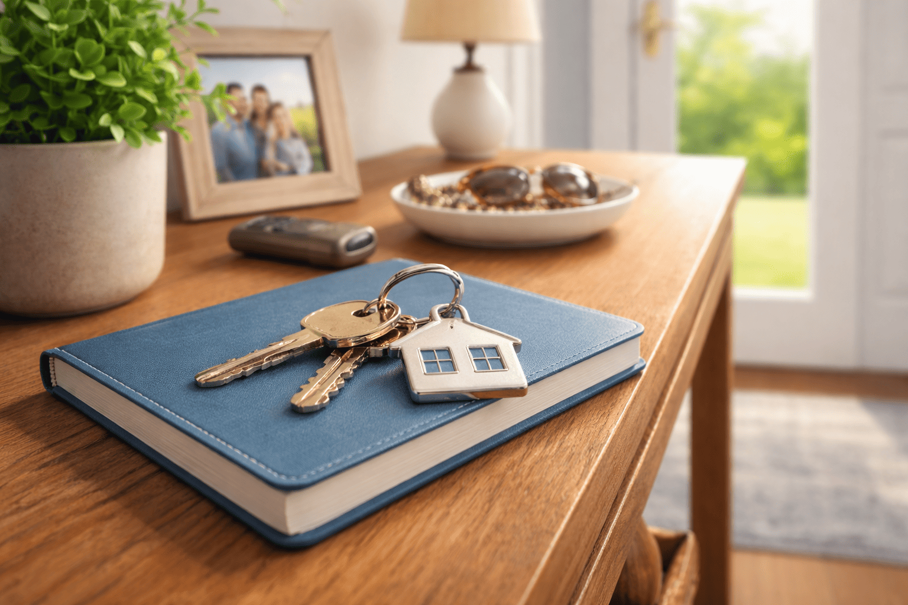

## One-Level Living Without Pressure

  

Downsizing later in life isn’t about rushing or giving something up.  
It’s about making a thoughtful decision that protects your **comfort, finances, and peace of mind**—now and in the years ahead.

This guide outlines a simple roadmap for homeowners who want **single-level living** and need to **sell their current home before buying**, without feeling pushed or overwhelmed.

---

## Who This Guide Is For

This guide is designed for homeowners who:
- Want **one-level or stair-free living**
- Plan to **sell their current home before buying**
- Prefer staying within a **clear, comfortable budget**
- Want to avoid rushed decisions or pressure
- Value guidance from a professional familiar with **sale-and-purchase contingencies**

---

## Step 1: Start With Clarity — Not Commitment

**Goal:** Understand your options without pressure.

Before listing your home, the first step is simply gaining clarity:
- What your current home may realistically sell for
- Estimated net proceeds after the sale
- What “one-level living” truly means for your lifestyle
- A price range that feels financially comfortable

At this stage, **nothing is listed** and **nothing is decided**.  
This is about information—not obligation.

---

## Step 2: Create a Safe Sale-First Plan

**Goal:** Remove the fear of being rushed or displaced.

Selling first can feel risky without a plan. A safe strategy may include:
- Flexible or extended closing timelines
- Negotiated possession options
- Backup housing plans (only if ever needed)
- A clear understanding of what happens if the right home doesn’t appear right away

You are never selling first and “hoping it works out.”

  

---

## Step 3: Quietly Preview One-Level Options

**Goal:** Build confidence before taking action.

Before your home goes on the market:
- Watch one-level homes and townhomes in your price range
- Tour selectively, without pressure to decide
- Learn what’s realistic—and what isn’t—at your budget
- Understand trade-offs calmly and clearly

This step is about **learning**, not choosing.

  

---

## Step 4: Prepare Your Current Home Gently

**Goal:** Maximize value without overwhelm.

Preparing to sell doesn’t mean doing everything—it means doing the **right** things:
- Identify only improvements that truly matter
- Avoid unnecessary projects
- Coordinate trusted professionals if needed
- Keep timelines flexible and manageable

The objective is a smooth sale—not perfection.

---

## Step 5: List With a Contingency Strategy in Place

**Goal:** Maintain control throughout the sale.

When the timing is right:
- Your home is priced thoughtfully, not aggressively
- Expectations are set clearly from the start
- Timing and possession are negotiated to protect your next step
- Replacement-home options stay active during the sale

You’re not giving up control—you’re gaining options.

---

## Step 6: Secure the Right Next Home

**Goal:** One move, done right.

An offer on your next home is made **only when**:
- The numbers make sense
- The layout supports long-term comfort
- The timing aligns with your sale
- You feel confident—not pressured

The goal is one well-planned transition, not multiple moves.

---

## Step 7: Close, Settle In, and Exhale

**Goal:** Peace of mind.

As everything comes together:
- Closings are coordinated when possible
- Move-in timing is handled carefully
- Support continues even after closing

A good guide doesn’t disappear at the finish line.

  

---

## A Gentle Next Step (If and When You’re Ready)

If you’re considering downsizing and would like a calm, pressure-free conversation about what this could look like for you, working with a professional who understands both sides—**selling and buying with contingencies**—can make all the difference.

**You don’t need pressure. You need a plan.**

---

---

### John Rackley  
📞 803-553-8233  
📧 jrrealmarketing@gmail.com  
🌐 bettercalljohn.house  

*“You’ve Got a Friend in the Upstate of S.C.”*

Licensed South Carolina real estate professional (SC LLR #98521).  
Mortgage services, if discussed, are offered separately as a licensed Mortgage Loan Originator (NMLS #161352).  
Equal Housing Opportunity. Content provided for educational purposes only and not a commitment to lend or guarantee of results.

